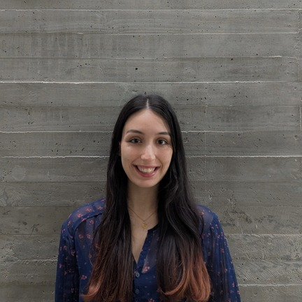
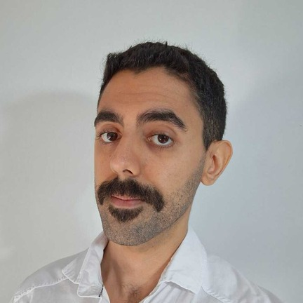

# 👨‍💻 FIUBA - Ingeniería de Software II - Grupo 8

Bienvenidos al espacio de trabajo del **Grupo 8** de la materia **Ingeniería de Software II (FIUBA)**.  
Aquí centralizamos el código y la documentación de nuestros proyectos.

## 📌 Información de la materia
📍 Universidad de Buenos Aires – Facultad de Ingeniería  
📚 Cátedra Ingeniería de Software II  
📅 Año 2025

## 🎯 Objetivos de la Organización
- Desarrollar la aplicación mobile 'Melodía' (Con su respectivo 'Backoffice' y todas los 'Microservicios' asociados) aplicando buenas prácticas de ingeniería.  
- Fomentar el trabajo en equipo, la modularización y el versionado colaborativo.  
- Documentar procesos, resultados y objetivos de manera clara y profesional.  

## 👥 Integrantes del Grupo 8

<table>
  <tr>
    <td align="center" width="220px">
       
      <b>Andresen Joaquín</b> 
      🎓 Padrón: 102707 
      DevOps / Backend 
      📧 jandresen@fi.uba.ar
    </td>
    <td align="center" width="220px">
       
      <b>Ascencio Felipe Santino</b> 
      🎓 Padrón: 110675 
      App Mobile 
      📧 fascencio@fi.uba.ar
    </td>
    <td align="center" width="220px">
       
      <b>Frascarelli Esteban</b> 
      🎓 Padrón: 105965 
      Backend / Bases de Datos 
      📧 efrascarelli@fi.uba.ar
    </td>
  </tr>
  <tr>
    <td align="center" width="220px">
       
      <b>General Camila</b> 
      🎓 Padrón: 105552 
      Backend / Diseño de UI 
      📧 cgeneral@fi.uba.ar
    </td>
    <td align="center" width="220px">
       
      <b>Guerrero Martín</b> 
      🎓 Padrón: 107774 
      Backoffice 
      📧 mguerrero@fi.uba.ar
    </td>
    <td align="center" width="220px">
       
      <b>Nicolás Ramiro Sanchez</b> 
      Corrector 
      📧 nrsanchez@fi.uba.ar
    </td>
  </tr>
</table>

